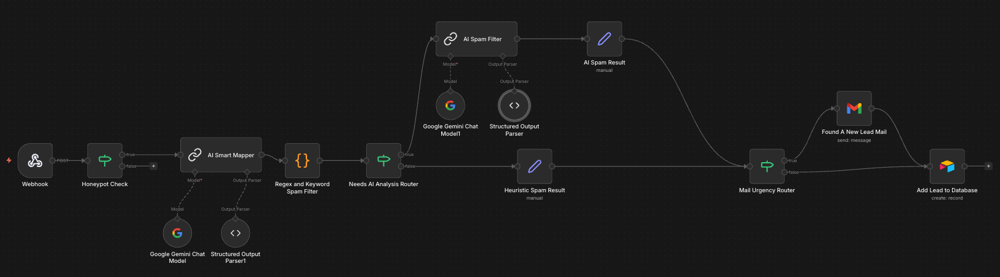
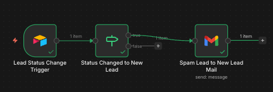

# N8N Lead Orchestration Engine

This directory contains the brain of the Gushwork Lead Capture ecosystem. The system is split into two distinct workflows:
1.  **Lead Capture & Qualification**: Handles real-time ingestion, normalization, spam filtering, and initial routing.
2.  **Lead Monitoring (Safety Net)**: A "Human-in-the-Loop" workflow that monitors Airtable for manual status corrections.

---

## 🏗️ Workflow 1: Lead Capture & Qualification
**File:** `lead_capturing_workflow.json`

This workflow is the entry point for all website submissions. It uses a tiered architecture to balance cost (LLMs) with speed (Heuristics).

### System Architecture

### Node-by-Node Explanation

#### 1. Ingestion Layer
*   **Webhook (`POST /capture-lead`)**: The entry point.
    *   **Security**: Validates the `x-gushwork-auth` header against the `AUTH_TOKEN` in `lead-capture.js`.
    *   **CORS**: Configured to accept requests from any origin (`*`) to support multi-client deployment.
*   **Honeypot Check (If Node)**:
    *   **Logic**: Checks if the hidden field `_gw_bot_trap` contains any data.
    *   **Action**: If fields are present, the execution STOPS immediately (saving compute).

#### 2. Normalization Layer
*   **AI Smart Mapper (Google Gemini Flash)**:
    *   **Problem**: Forms use random field names (`your-name`, `fname_732`, `email_addr`).
    *   **Solution**: Uses a fast, low-cost LLM (Gemini Flash) to extract standard entities: `Name`, `Email`, `Phone`, `Message`.
    *   **Output**: A clean JSON object regardless of the input structure.

#### 3. Spam Defense Matrix (Hybrid Strategy)
This two-step process reduces LLM costs by ~60% by catching obvious spam first.

*   **Layer 1: Heuristic Spam Filter (Code Node)**:
    *   Run fast, deterministic checks using RegEx and logic:
        *   **Shouting**: >40% caps lock.
        *   **Gibberish**: Strings with no vowels (e.g., `bcdfghjkl`).
        *   **Pattern Matching**: `Name` == `Surname` (common bot behavior).
        *   **Keywords**: "crypto", "seo", "investment".
    *   **Output**: Sets `status = "Possible Spam"` and `needs_ai_analysis = false`.

*   **Router (`Needs AI Analysis`)**:
    *   If Layer 1 flushed the lead as spam -> Skip AI.
    *   If Layer 1 says "Clean" -> Send to AI for deep analysis.

*   **Layer 2: AI Spam Filter (Google Gemini Flash)**:
    *   **Role**: Semantic analysis of *intent*.
    *   **Prompt**: Acts as a "Sales Quality Expert" to distinguish between a *sales pitch* (which is spam to us) and a *purchase inquiry* (a lead).
    *   **Structured Output**: Returns `is_spam: boolean` and a reasoning string.

#### 4. Routing & Notification
*   **Airtable (`Add Lead to Database`)**:
    *   All leads (Spam or Legit) are saved to Airtable for audit trails.
*   **Mail Router**:
    *   **Condition**: Specific check for `Status == 'New Lead'`.
    *   **Action**: Triggers the "Found A New Lead" Gmail node to alert the sales team instantly.

---

## 🛡️ Workflow 2: Lead Status Monitoring (Safety Net)
**File:** `lead_monitoring_workflow.json`

This workflow ensures no lead is left behind. If the AI incorrectly marks a lead as "Spam", a human can fix it in Airtable, and this workflow will detect that fix and send the alert.

### process Flow

### Logic Breakdown

1.  **Airtable Trigger (Polling)**:
    *   Checks the database every **1 minute**.
    *   **Trigger Field**: Watches the `Updated at` timestamp.
2.  **Change Detection (If Node)**:
    *   We don't want to alert on *every* update (e.g., fixing a typo).
    *   **Condition 1**: `Status` equals `New Lead`.
    *   **Condition 2**: `Updated at` > `Created at` + 1second. This proves the record is an *update*, not a new creation.
3.  **Notification (`Spam Lead to New Lead Mail`)**:
    *   Sends a "Found A New Lead" mail to alert the sales team instantly.

---

## ⚙️ Configuration & Setup

### 1. Credentials Required
To run these workflows, you must set up the following credentials in your N8N instance:

| Service | Credential Name in N8N | Purpose |
| :--- | :--- | :--- |
| **Google Gemini** | `Google Gemini(PaLM) Api account` | Powering the Smart Mapper and Spam Filter. |
| **Airtable** | `Airtable Personal Access Token account` | Database read/write operations. |
| **Gmail** | `Gmail OAuth2` | Sending email notifications. |
| **Header Auth** | `Header Auth account` | Securing the webhook endpoint. |

### 2. Environment Variables
Ensure your N8N environment allows for:
*   **Execution Data**: Save execution data for failed workflows to debug spam logic.
*   **Timezone**: Set `GENERIC_TIMEZONE` to your local time (e.g., `Asia/Kolkata`) for accurate timestamp comparisons.
